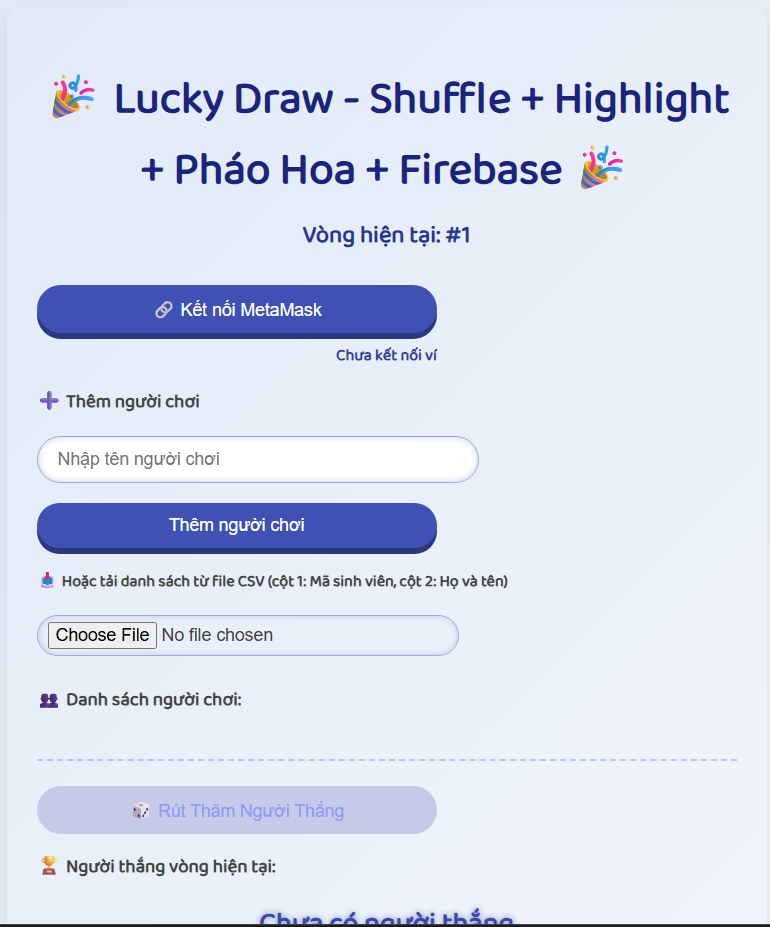

# BlockChain Project

## Giới thiệu
Dự án Blockchain nhằm xây dựng hệ thống rút thăm trúng thưởng phi tập trung trên nền tảng Ethereum.

## Tính năng chính
- Triển khai hợp đồng thông minh (Smart Contract) trên mạng Sepolia testnet.
- Giao diện người dùng để tham gia rút thăm.
- Hiển thị kết quả ngẫu nhiên, minh bạch.

## Công nghệ sử dụng
- Solidity cho hợp đồng thông minh.
- React cho frontend.
- Node.js cho backend.
- MetaMask để kết nối ví.

## Luồng hoạt động chính



## Hướng dẫn chạy dự án

```bash
git clone https://github.com/j1weng1923/BlockChain.git
cd BlockChain
npm install
npm start
